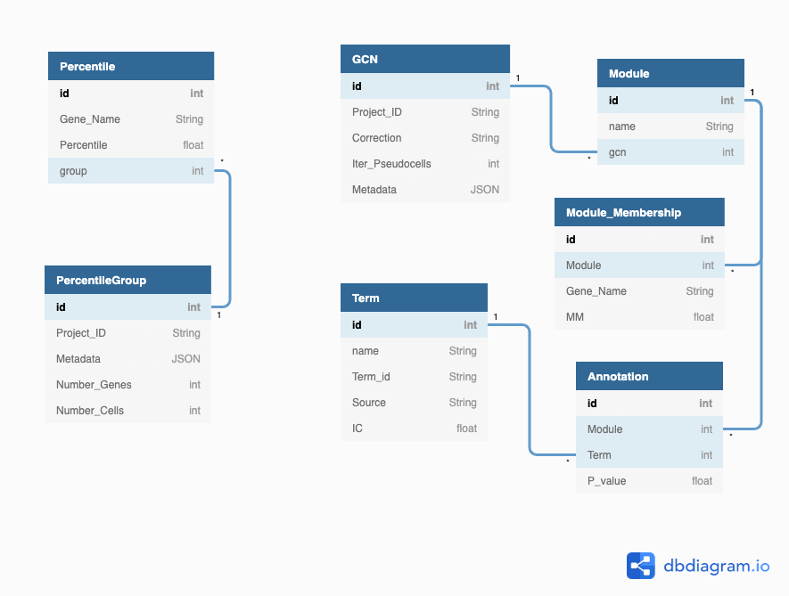

# Database

Our database has the following design:

In the notebook called [Creating_DB_Schema](Database/Creating_DB_Schema.ipynb) you can find the process of creating the schema, and with the script [Create_tables](Database/Create_tables.py) you can create it quickly. 

Inserting the instances in the database is another important part, in the notebook [Adding_instances](Database/Adding_instances.ipynb) is explained how we can insert instances in the databse, and in the class [Postgres_Controller](Database/Postgres_Controller.py) we implement all the functionality needed to insert the percentiles and the GCNs.

Lastly, we can see in the notebook [Percentile_queries](Database/Percentile_queries.ipynb) some statistics of the percentiles inserted in the database and the efficiency of the queries.

# Percentiles

The creation of the percentiles requeries splitting the projects in samplings, in the notebook [Percentile_groups](Percentiles/Percentile_groups.ipynb) is explained all the process of generating the samplings. In the notebook [Percentile_generation_algorithm](Percentiles/Percentile_generation_algorithm.v1.ipynb) is explained the algorithm to generate the percentiles of a project. **If you want to create the percentiles of a project**, use the [PercentileCreation](Percentiles/PercentileCreation.py) file.
